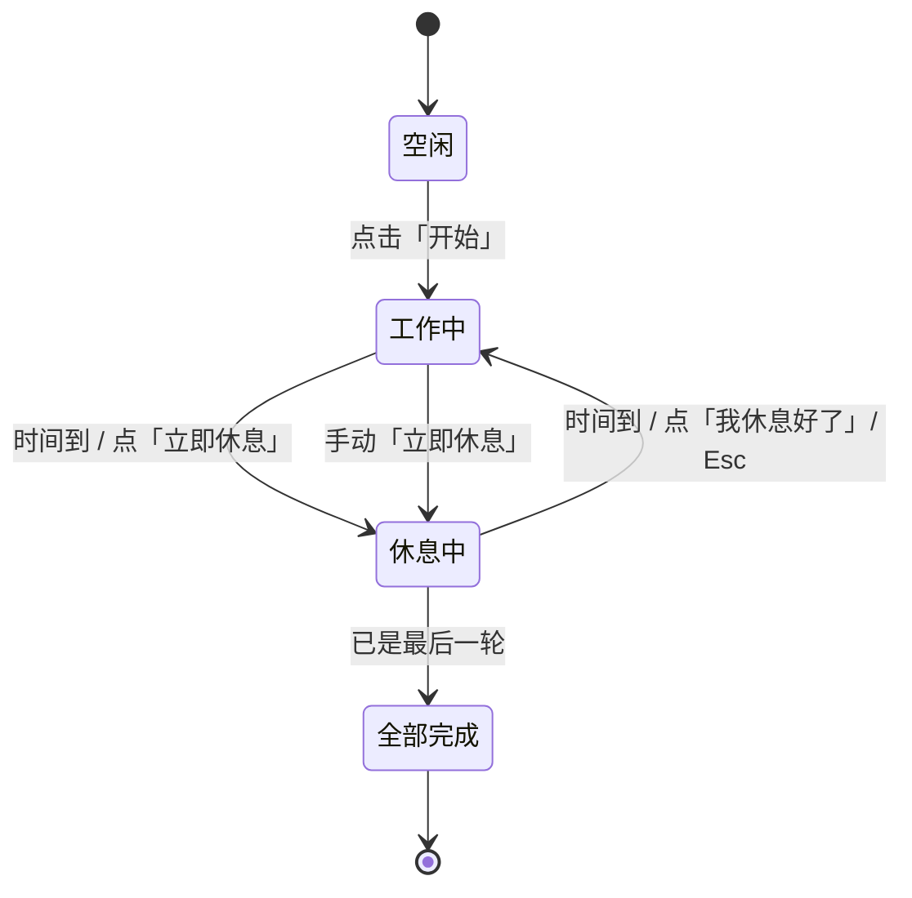

# 🤖 WALL-E 桌面宠物 · 操作手册

> 一只以电影《机器人总动员》主角 **WALL-E（瓦力）** 为原型的 Windows 桌面宠物。
> 采用像素风动画形象，会眨眼、张望、挥手、欢呼、撒娇。它能用瓦力的憨厚语气
> **陪你日常聊天、缓解工作压力**，也能帮你管理待办清单、用「番茄钟」专注与休息。

---

## 目录

1. [功能总览](#一功能总览)
2. [快速开始（三种使用方式）](#二快速开始)
3. [安装与卸载](#三安装与卸载)
4. [桌面宠物操作](#四桌面宠物操作)
5. [对话助手：制定工作计划](#五对话助手制定工作计划)
6. [待办清单管理](#六待办清单管理)
7. [番茄钟：工作休息循环](#七番茄钟工作休息循环)
8. [休息全屏提醒](#八休息全屏提醒)
9. [系统托盘菜单](#九系统托盘菜单)
10. [设置与数据保存位置](#十设置与数据保存位置)
11. [从源码运行 / 重新打包](#十一从源码运行--重新打包)
12. [常见问题 FAQ](#十二常见问题-faq)

---

## 一、功能总览

| 功能 | 说明 |
| --- | --- |
| 🐾 桌面宠物 | 像素风 WALL-E 悬浮桌面，会眨眼/张望/挥手/欢呼，可拖动、始终置顶 |
| 💬 暖心对话 | 用瓦力语气陪你聊天、缓解压力；**只有明确说「记一下…」才会记任务** |
| 📋 待办清单 | 增删任务、勾选完成（自动划掉）、清除已完成 |
| ⏱️ 番茄钟 | 自定义「工作 N 分钟 / 休息 M 分钟 / 循环 X 次」 |
| 🛌 休息提醒 | 到点后瓦力放大占满屏幕提醒休息，结束自动恢复 |
| 🖐️ 手动控制 | 可随时提前开始休息，或提前结束休息 |
| 🔔 系统托盘 | 常驻托盘，关闭窗口不退出，随用随开 |

---

## 二、快速开始

你可以用以下任意一种方式启动瓦力：

### 方式 A：直接运行打包好的程序（最简单，推荐普通用户）

1. 进入项目文件夹，双击 `dist\WALL-E.exe`。
2. 瓦力会出现在桌面**右下角**，托盘区也会出现它的图标。
3. **单击**瓦力或托盘图标 → 打开「控制台」。

### 方式 B：安装到系统并创建快捷方式（推荐长期使用）

1. 双击运行 `install.bat`。
2. 按提示选择是否「开机自启动」。
3. 安装完成后，双击桌面的「**WALL-E 桌面宠物**」快捷方式即可启动。

### 方式 C：从源码运行（开发者）

```powershell
# 在项目根目录执行
.\.venv\Scripts\python.exe run.py
```

详见 [第十一节](#十一从源码运行--重新打包)。

---

## 三、安装与卸载

### 安装

| 步骤 | 操作 |
| --- | --- |
| 1 | 双击 `install.bat` |
| 2 | 程序复制到 `%LOCALAPPDATA%\Programs\WALL-E` |
| 3 | 在桌面创建快捷方式 |
| 4 | 询问是否设为开机自启（输入 `Y`/`N`） |

### 卸载

双击 `uninstall.bat` 即可：
- 关闭正在运行的瓦力
- 删除安装目录与快捷方式
- 移除开机自启项

> 💡 卸载**不会**删除你的待办与设置（保存在 `%APPDATA%\WALL-E`）。如需彻底清除，手动删除该文件夹即可。

---

## 四、桌面宠物操作

瓦力始终悬浮在所有窗口之上，背景透明。它支持的交互：

| 操作 | 效果 |
| --- | --- |
| **按住左键拖动** | 移动瓦力到任意位置（位置会自动记忆，下次启动还在原处） |
| **单击** | 打开 / 唤起控制台窗口 |
| **双击** | 打开控制台 |
| **右键** | 弹出快捷菜单（打开控制台 / 开始番茄钟 / 立即休息 / 退出） |
| 丰富动画 | 像素风瓦力会不定时眨眼、左右张望、说话；聊天时还会随情绪做出鼓掌、爱心、撒娇、疲惫等表情 |
| 头顶气泡 | 重要提示（如开始专注、全部完成）会以气泡形式弹出 |

---

## 五、对话助手：陪你聊天，也帮你记事

打开控制台 → 切到 **💬 对话** 标签页，直接用中文和瓦力聊天。

> 💡 **重要变化**：瓦力默认是你的**陪伴伙伴**——平时随便聊天、吐槽、放松心情都可以，它会用憨厚温暖的语气回应你、帮你缓解压力。**只有当你明确说「记一下…/添加…」时，才会把内容加入待办**，不会再把随口一句话都变成任务。

**日常陪伴（不会产生待办）**

| 你说 | 瓦力会做 |
| --- | --- |
| `你好` / `在吗` | 温暖问候，露出开心表情 |
| `好累啊` / `压力好大` / `想哭` | 共情安慰，建议你歇一歇，做出疲惫/休息表情 |
| `好烦` / `无聊` / `好孤单` | 陪你聊聊、帮你打包烦恼、提个小建议 |
| `谢谢你` / `你真可爱` | 害羞撒娇、比心 ❤️ |
| `太好了` / `完成了` | 一起欢呼鼓掌 🎉 |
| `你是谁` | 自我介绍 |

**明确指令（管理待办与计时）**

| 你说 | 瓦力会做 |
| --- | --- |
| `记一下 交房租` / `添加 写周报、回复邮件` | 加入待办（支持用「、，；」一次加多条） |
| `完成 写周报` / `写周报 做完了` | 把匹配的任务**划掉**（标记完成） |
| `删除 写周报` | 从清单移除该任务 |
| `列表` / `清单` | 列出当前全部待办与已完成项 |
| `开始工作` / `开始番茄钟` | 启动番茄钟计时 |
| `我要休息` / `休息一下` | 立刻进入休息提醒 |
| `休息好了` / `继续工作` | 提前结束休息 |
| `帮助` | 显示完整指令说明 |

> 这是**离线规则引擎**，无需联网、不上传任何数据，隐私安全。

---

## 六、待办清单管理

切到 **📋 待办** 标签页：

- **添加**：在输入框输入任务，按回车或点「添加」。
- **完成 / 划掉**：勾选任务前的复选框，文字会显示**删除线**并变灰。再次取消勾选可恢复。
- **删除单条**：**双击**该任务即可删除。
- **清除已完成**：一键移除所有打勾的任务。
- **清空全部**：清除整个清单。

所有改动都会**实时自动保存**，重启后依旧保留。

---

## 七、番茄钟：工作休息循环

切到 **⏱️ 番茄钟** 标签页：

### 设置参数

| 参数 | 默认值 | 范围 | 说明 |
| --- | --- | --- | --- |
| 工作时长（分钟） | 50 | 1–180 | 每轮专注时间 |
| 休息时长（分钟） | 10 | 1–120 | 每轮休息时间 |
| 循环次数 | 3 | 1–12 | 重复「工作+休息」的轮数 |
| 休息提醒提示音 | 开 | 开/关 | 进入休息时是否响铃 |

> 例：设为「工作 50 / 休息 10 / 循环 3」，即 **工作50min → 休息10min**，如此循环 **3** 次后结束。参数改动即时生效并保存。

### 控制按钮

| 按钮 | 作用 |
| --- | --- |
| ▶ 开始 | 从第 1 轮开始完整的番茄钟循环 |
| ☕ 立即休息 | 不管当前进度，**马上进入休息状态** |
| ■ 停止 | 终止计时，回到空闲 |

界面顶部会实时显示当前状态（专注第几轮 / 休息中 / 全部完成）和**倒计时**。

---

## 八、休息全屏提醒

这是本软件的核心特色，完全符合你的需求：

1. **到达休息时间**时：
   - 瓦力形象**放大并占据屏幕主要空间**，半透明深色背景覆盖整个屏幕，强制你从工作中抽离。
   - 屏幕中央显示「休息时间到啦！」、放松小贴士（轮播）、以及**休息倒计时**。
2. **休息时间结束**时：
   - 全屏提醒**自动消失**，瓦力**恢复原来的尺寸和位置**，自动进入下一轮工作。
3. **手动提前结束休息**：
   - 点击全屏中央的「**✔ 我休息好了，提前结束**」按钮，或直接按 **Esc** 键，即可立刻退出休息、回到工作。
4. **随时提前启动休息**：
   - 在番茄钟页点「☕ 立即休息」；
   - 或右键瓦力 →「☕ 立即休息」；
   - 或对瓦力说「我要休息」。



---

## 九、系统托盘菜单

瓦力常驻 Windows 右下角托盘。**右键托盘图标**可：

- 打开控制台
- 显示 / 隐藏桌面宠物
- ▶ 开始番茄钟
- ☕ 立即休息
- ■ 停止计时
- 退出

> 关闭控制台窗口**不会**退出程序，瓦力仍驻留托盘。要完全退出，请用托盘或右键菜单的「退出」。

---

## 十、设置与数据保存位置

所有数据保存在：`%APPDATA%\WALL-E\`

| 文件 | 内容 |
| --- | --- |
| `settings.json` | 番茄钟参数、宠物位置、提示音开关等 |
| `todos.json` | 待办清单 |

删除这些文件即可恢复出厂设置。

---

## 十一、从源码运行 / 重新打包

### 环境要求
- Windows 10/11
- Python 3.10+（项目已用 3.12 验证）

### 首次准备
```powershell
# 创建虚拟环境并安装依赖
python -m venv .venv
.\.venv\Scripts\python.exe -m pip install -r requirements.txt
```

### 直接运行
```powershell
.\.venv\Scripts\python.exe run.py
```

### 重新打包成 EXE
```powershell
# 一键打包（自动装依赖、生成图标、打包）
.\build.bat
```
或手动：
```powershell
.\.venv\Scripts\python.exe -m pip install -r requirements-dev.txt
.\.venv\Scripts\python.exe make_icon.py
.\.venv\Scripts\python.exe -m PyInstaller --noconfirm --clean WALL-E.spec
```
产物位于 `dist\WALL-E.exe`（单文件，约 45 MB，含像素动画资源，无需安装 Python 即可在其他 Windows 上运行）。

### 项目结构
```
WALL-E/
├─ run.py                 启动入口
├─ smoke_test.py          离屏逻辑测试
├─ make_icon.py           生成图标
├─ build.bat              一键打包
├─ install.bat            安装 + 快捷方式
├─ uninstall.bat          卸载
├─ WALL-E.spec            PyInstaller 配置
├─ requirements.txt       运行依赖
├─ requirements-dev.txt   打包依赖
├─ assets/walle.ico       应用图标
└─ walle/                 源码包
   ├─ app.py              主程序（整合 + 信号连接）
   ├─ config.py           配置持久化
   ├─ todo_manager.py     待办数据
   ├─ chatbot.py          对话规则引擎（陪伴聊天 + 指令）
   ├─ pomodoro.py         番茄钟状态机
   ├─ walle_sprite.py     像素动画图集加载器
   ├─ animator.py         动画播放器（逐帧驱动）
   ├─ legacy_sprite.py    矢量绘制（资源缺失时的降级方案）
   ├─ pet_window.py       桌面悬浮宠物
   ├─ control_panel.py    控制台（对话/待办/番茄钟）
   ├─ rest_overlay.py     休息全屏提醒
   └─ assets/             像素动画帧与动作清单
      ├─ frames/          各动作帧 PNG
      └─ animations.json  动作→帧序列定义
```

---

## 十二、常见问题 FAQ

**Q：双击 exe 没反应？**
A：留意屏幕**右下角**和**托盘区**，瓦力默认出现在桌面右下角。若仍看不到，右键托盘图标 →「显示/隐藏宠物」。

**Q：杀毒软件 / SmartScreen 拦截？**
A：PyInstaller 打包的未签名 exe 有时会被提示。点「更多信息 → 仍要运行」即可，程序完全本地运行、不联网。

**Q：休息全屏挡住了正在做的事怎么办？**
A：点中央按钮「我休息好了」或按 **Esc** 立即退出休息。

**Q：怎么让它开机自启？**
A：运行 `install.bat` 时选择 `Y`；或手动把快捷方式放进 `shell:startup` 文件夹。

**Q：换了电脑想保留待办？**
A：复制 `%APPDATA%\WALL-E` 文件夹到新电脑同名位置即可。

---

🎬 *“WALL-E…” —— 愿这只小机器人陪你高效又健康地工作！*
